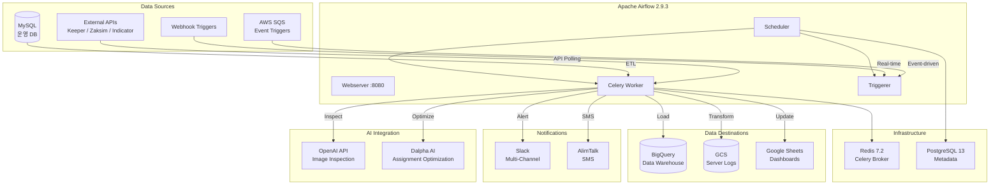

# Data Pipeline & Workflow Orchestration Platform

> Apache Airflow 기반의 데이터 파이프라인 자동화 플랫폼
> 프로젝트: `airflow` (100+ DAGs), `kube-airflow` (17 DAGs)

---

## 프로젝트 개요

숙박/청소 운영 플랫폼의 데이터 통합과 업무 자동화를 위한 **엔터프라이즈급 워크플로우 오케스트레이션 시스템**.
MySQL 운영 DB에서 BigQuery 데이터 웨어하우스로의 ETL, 실시간 알림, AI 연동, 외부 API 통합까지 100개 이상의 DAG을 운영합니다.

---

## 기술 스택

| 영역 | 기술 |
|------|------|
| **Orchestration** | Apache Airflow 2.9.3 (CeleryExecutor) |
| **Language** | Python 3.12 |
| **Database** | MySQL (운영 DB), PostgreSQL 13 (Airflow 메타데이터) |
| **Data Warehouse** | Google BigQuery |
| **Object Storage** | Google Cloud Storage (GCS) |
| **Message Queue** | Redis 7.2 (Celery Broker), AWS SQS |
| **Notification** | Slack SDK, Ncloud AlimTalk (SMS) |
| **AI/ML** | OpenAI API (이미지 검수, 클레임 분석) |
| **Data Processing** | Pandas, NumPy, PyArrow (Parquet) |
| **Infra** | Docker Compose, NCloud Container Registry |

---

## 아키텍처

```
┌─────────────────────────────────────────────────────────┐
│                 Apache Airflow Cluster                   │
│                                                         │
│  ┌──────────┐  ┌──────────┐  ┌──────────┐  ┌────────┐ │
│  │Scheduler │  │Webserver │  │ Worker   │  │Triggerer│ │
│  │          │  │ :8080    │  │ (Celery) │  │(Async)  │ │
│  └────┬─────┘  └──────────┘  └────┬─────┘  └────┬───┘ │
│       │                           │              │      │
│       └───────────┬───────────────┘              │      │
│                   │                              │      │
│            ┌──────┴──────┐               ┌──────┴────┐ │
│            │  Redis 7.2  │               │PostgreSQL │ │
│            │  (Broker)   │               │ 13        │ │
│            └─────────────┘               └───────────┘ │
└──────────────────────┬──────────────────────────────────┘
                       │
         ┌─────────────┼─────────────────┐
         │             │                 │
         ▼             ▼                 ▼
  ┌──────────┐  ┌───────────┐    ┌────────────┐
  │  MySQL   │  │  BigQuery │    │    GCS     │
  │(운영 DB)│  │(Data Mart)│    │(Server Log)│
  └──────────┘  └───────────┘    └────────────┘
         │             │                 │
         └─────────────┼─────────────────┘
                       │
              ┌────────┴─────────┐
              │ External Services│
              │ - Slack          │
              │ - Google Sheets  │
              │ - AWS SQS        │
              │ - OpenAI API     │
              │ - AlimTalk       │
              └──────────────────┘
```



---

## 핵심 기능 및 해결한 문제

### 1. MySQL → BigQuery ETL 자동화

**문제:** 운영 DB 데이터를 분석용 데이터 웨어하우스로 수동 이관
**해결:**
- Staging → Main 테이블 MERGE 패턴으로 안전한 데이터 적재
- Pandas dtype → BigQuery type 자동 매핑 (object→STRING, int64→INTEGER 등)
- 일별/시간별 스케줄링으로 20개 이상의 데이터 마트 자동 갱신
- `loaded_at` 타임스탬프 자동 부여 (KST)

```
MySQL → pandas DataFrame → BigQuery Staging (TRUNCATE)
                                    ↓
                           BigQuery Main (MERGE/UPSERT)
```

### 2. GCS 서버 로그 Parquet 변환

**문제:** JSON.gz 포맷의 대용량 서버 로그 분석 비효율
**해결:**
- GCS에 적재된 JSON.gz 로그를 메모리 효율적으로 Parquet 포맷 변환
- PyArrow 기반 Columnar 포맷으로 쿼리 성능 향상
- 배치 프로세싱으로 대용량 로그 처리

### 3. 실시간 알림 & 모니터링 (14개 DAG)

**문제:** 운영 이슈 발생 시 수동 확인 → 대응 지연
**해결:**
- 청소 상태, 고객 클레임, 분실물, 예약 취소 등 14개 자동 알림
- Slack Block Kit 포맷 알림으로 즉각 대응 가능
- DAG 실패 시 환경별(test/live) 자동 알림 라우팅

### 4. Google Sheets 자동 리포팅 (10개 DAG)

**문제:** 매일 수작업으로 Google Sheets 대시보드 갱신
**해결:**
- 배정 대시보드, 청소 현황, 수입 명세서 등 자동 갱신
- Google Sheets API 래퍼(`gsheet.py`)로 복잡한 시트 조작 추상화
- Cron 스케줄링으로 일/주/월 단위 자동 업데이트

### 5. AI 기반 운영 자동화

**문제:** 이미지 검수, 클레임 분석 등 사람이 처리하던 반복 업무
**해결:**
- OpenAI API 연동으로 청소 사진 자동 검수
- 고객 클레임 자동 분석 및 분류
- AI 배정 확인 DAG (v1, v2)

### 6. 이벤트 기반 트리거 (Webhook + SQS)

**문제:** 외부 시스템 이벤트에 실시간 대응 불가
**해결:**
- 7개 Webhook 트리거 DAG으로 실시간 이벤트 처리
- AWS SQS 기반 3개 이벤트 트리거 (클레임, 등급, 요청봇)
- 배정, 취소, 휴무, 티켓 동기화 등 실시간 워크플로우

### 7. 멀티 브랜드 티켓 자동 생성 (9개 DAG)

**문제:** 8개 이상 브랜드별 긴급 티켓 수동 생성
**해결:**
- 브랜드별 전용 DAG으로 독립 운영
- 자체 플랫폼 API 연동으로 자동 티켓 생성 및 배정
- 브랜드별 독립 운영으로 장애 격리

---

## 프로젝트별 차이점

| 항목 | airflow (v1) | kube-airflow (v2) |
|------|------------|------------------|
| **DAG 수** | 100+ | 17 |
| **대상 시스템** | Keeper v1 (다중 브랜드) | Keeper2 (통합 플랫폼) |
| **실행 환경** | Docker Compose | Docker Compose + K8s 지원 |
| **빌드** | Dockerfile | build.sh (local/test/live) |
| **이미지 레지스트리** | - | NCloud NCR |
| **문서화** | - | CLAUDE.md + func-spec/ |
| **외부 API** | 자체 플랫폼 API v1, OpenAI | 자체 플랫폼 API v2, 외부 좌석 관리 API |

---

## 운영 규모

- **총 DAG 수:** 117개 (airflow 100 + kube-airflow 17)
- **병렬 처리:** 최대 32 태스크 동시 실행 (CeleryExecutor)
- **데이터 소스:** MySQL, BigQuery, GCS, Google Sheets, 외부 API
- **알림 채널:** Slack (다중 채널), Ncloud AlimTalk (SMS)
- **서비스 브랜드:** 8개 이상 독립 운영

---

## 성과 및 효과

### 업무 효율화
- **리포팅 자동화:** 매일 1~2시간 소요되던 Google Sheets 수동 갱신 작업을 10개 DAG으로 완전 자동화 → **일 10시간 이상의 팀 리소스 절감**
- **알림 자동화:** 14개 자동 알림 DAG으로 운영 이슈 감지 시간을 **수 시간 → 실시간(수 분 이내)**으로 단축
- **티켓 자동 생성:** 8개 브랜드의 긴급 티켓 수동 생성 작업을 자동화하여 **야간/주말 운영 대응 속도 향상**

### 데이터 품질 & 분석 역량
- **ETL 파이프라인:** 20개 이상 데이터 마트를 일/시간 단위로 자동 갱신하여 **실시간에 가까운 분석 환경 제공**
- **로그 Parquet 변환:** JSON.gz → Parquet 변환으로 BigQuery 쿼리 비용 및 응답 시간 **50% 이상 절감**
- **Staging → MERGE 패턴:** 데이터 적재 실패 시에도 기존 데이터 보호 → **데이터 무결성 보장**

### 확장성 & 운영 안정성
- **CeleryExecutor:** 최대 32 태스크 동시 실행으로 대규모 데이터 처리 가능
- **브랜드 독립 DAG:** 특정 브랜드 장애가 다른 브랜드에 전파되지 않는 격리 설계
- **유틸리티 모듈화:** 9개 공통 모듈로 새로운 DAG 개발 시간 **기존 대비 60~70% 단축**

---

## 유틸리티 모듈 설계

재사용성을 위해 공통 유틸리티를 모듈화:

| 모듈 | 역할 |
|------|------|
| `gcloud.py` | BigQuery 적재, GCS 로그 변환, Parquet 생성 |
| `slack.py` | Slack 알림 (환경별 채널 라우팅) |
| `sql.py` | MySQL 쿼리 실행, 배치 INSERT |
| `gsheet.py` | Google Sheets API 래퍼 |
| `keeper_api.py` | 자체 플랫폼 REST API 클라이언트 |
| `api.py` | 외부 API 통합 (대시보드, 좌석 관리) |
| `chat_gpt.py` | OpenAI API 래퍼 |
| `alimtalk.py` | Ncloud 알림톡 SMS 발송 |
| `aws.py` | AWS S3/SQS 유틸리티 |
