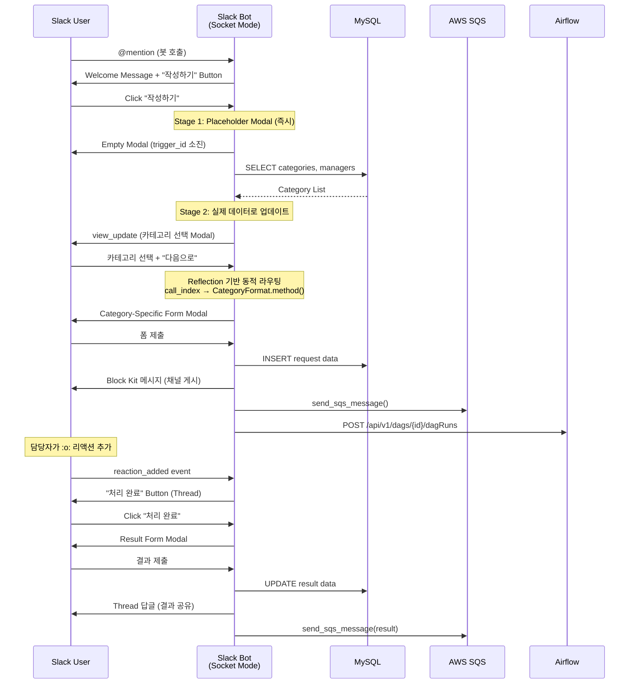

# Slack 업무 요청 접수봇 시스템

> Slack Bolt 기반 멀티 테넌트 업무 요청 접수 자동화 플랫폼
> 프로젝트: `request-bot`, `partner-request-bot`, `eleven-request-bot`

---

## 프로젝트 개요

3개의 독립적인 Slack 봇이 각각 다른 이해관계자의 업무 요청을 처리하는 **멀티 테넌트 업무 요청 관리 시스템**.
Slack Modal 기반의 대화형 폼으로 요청을 접수하고, MySQL 저장 → AWS SQS 큐잉 → Airflow DAG 트리거까지 End-to-End 자동화를 구현합니다.

| 봇 | 대상 | 역할 |
|------|------|------|
| **request-bot** | 고객사 → 본사 | 고객 클레임, 업무 요청 접수 (V1/V2) |
| **partner-request-bot** | 파트너사(운영) → 본사 | 운영 업무 요청 접수 (9개 카테고리) |
| **eleven-request-bot** | 본사 → 고객사 | 시설 관리 요청 접수 |

---

## 기술 스택

| 영역 | 기술 |
|------|------|
| **Language** | Python 3.12 |
| **Framework** | Slack Bolt (Socket Mode) |
| **Database** | MySQL (NCloud VPC) |
| **Message Queue** | AWS SQS (ap-northeast-2) |
| **Orchestration** | Apache Airflow REST API 연동 |
| **Data Processing** | Pandas, NumPy |
| **Package Manager** | pip / uv (partner-request-bot) |
| **Deployment** | Docker → NCloud NCR → ArgoCD GitOps |
| **CI/CD** | GitHub Actions |

---

## 아키텍처

```
┌──────────────────────────────────────────────────────┐
│                    Slack Workspace                     │
│                                                        │
│  User @mentions bot                                    │
│       ↓                                               │
│  Welcome Message + "작성하기" Button                    │
│       ↓                                               │
│  ┌────────────────────────────────────┐               │
│  │     2-Stage Modal Loading          │               │
│  │  1. Placeholder (즉시 - 3초 제한)  │               │
│  │  2. DB 조회 후 실제 데이터 업데이트 │               │
│  └────────────────────────────────────┘               │
│       ↓                                               │
│  Category Selection → Dynamic Form Routing             │
│       ↓                                               │
│  Category-Specific Modal (Reflection 기반)             │
│       ↓                                               │
│  Form Submit                                           │
└──────┬───────────────────────────────────────────────┘
       │
       ├──→ Slack Channel (Block Kit 메시지 게시)
       │
       ├──→ MySQL INSERT (ops_request_list / client_request_list)
       │
       ├──→ AWS SQS (비동기 메시지 큐잉)
       │
       └──→ Airflow REST API (DAG 트리거)
              ↓
       후속 자동화 처리 (알림, 리포트, 동기화)
```



---

## 핵심 기능 및 해결한 문제

### 1. 2-Stage Modal Loading 패턴

**문제:** Slack trigger_id는 3초 내 사용해야 하지만, DB 조회에 시간 소요
**해결:**
```
Stage 1: 빈 Placeholder Modal 즉시 열기 (trigger_id 소진)
Stage 2: DB에서 카테고리/매니저 데이터 조회 후 view_update로 업데이트
```
- trigger_id 만료 문제 해결
- 사용자 경험 개선 (빠른 응답)

### 2. Reflection 기반 동적 폼 라우팅

**문제:** 카테고리 추가 시마다 if-else 분기 코드 수정 필요
**해결:**
```python
# DB에서 call_index 조회 → Python inspect로 메서드 동적 호출
call_index = Validation.find_category_method(category_name)
methods = Validation.get_class_methods(CategoryFormat)  # ['a_basic', 'b_attachment', ...]
modal = Validation.call_method_by_index(instance, methods, call_index)
```
- 새 카테고리 추가 시: DB에 row 추가 + CategoryFormat에 메서드 추가만으로 완료
- 하드코딩 없는 확장 가능한 설계

### 3. End-to-End 요청 생명주기 관리

**문제:** 요청 접수 → 처리 → 결과 보고까지 수동 추적
**해결:**
```
1. 접수: Modal 폼 제출 → DB 저장 + Slack 채널 게시
2. 처리: 담당자가 이모지 리액션(:o:) → "처리 완료" 버튼 표시
3. 결과: 결과 Modal 작성 → Thread 답글 + DB 업데이트
4. 후속: SQS → Airflow DAG 트리거로 자동화 처리
```
- Thread 기반 대화로 요청별 이력 추적
- root_trigger_id + thread_ts로 End-to-End 추적 가능

### 4. 멀티 데이터베이스 전략 (V2)

**문제:** 읽기/쓰기 DB 분리 필요 + 환경별 설정 관리
**해결 (request-bot V2 DAO):**
```python
class Dao:
    def __init__(self, env):
        self.butler_db = butler_live if env == 'live' else butler_test  # READ
        self.biz_db = biz_live if env == 'live' else biz_test          # WRITE
```
- Butler DB (읽기 전용): 룸/브랜치/카테고리 마스터 데이터
- Biz DB (쓰기): 요청/클레임 트랜잭션 데이터
- 환경 변수 기반 live/test 자동 전환

### 5. Socket Mode 통신

**문제:** 공인 IP/도메인 없이 Slack 봇 운영 필요
**해결:**
- WebSocket 기반 Socket Mode로 인바운드 방화벽 설정 불필요
- 자동 재연결 로직 (BrokenPipeError 핸들링)
- Kubernetes 환경에서도 Ingress 없이 운영 가능

---

## 봇별 상세 기능

### request-bot (고객 요청 + 클레임)
- **V1:** 고객 클레임 관리 (패널티 등급: A/B/C/INVALID, 승인/거부 워크플로우)
- **V2:** 범용 업무 요청 시스템 (DAO 패턴, 환경별 DB 분리)
- **코드량:** ~3,637줄 (app.py 1,672줄)
- **특징:** V1→V2 마이그레이션으로 아키텍처 개선 이력

### partner-request-bot (파트너 운영 요청)
- **카테고리:** 9개 (기본요청, 첨부파일, 인증, 채용, 계약, 상세청소, 정산, 정산-Z0001, 버그리포트)
- **패키지 관리:** uv (모던 Python 패키지 매니저)
- **코드량:** ~3,039줄 (app.py 1,219줄 + template.py 1,438줄)
- **특징:** Airflow DAG 직접 트리거, 운세 기능 등 팀 문화 요소

### eleven-request-bot (시설 관리 요청)
- **대상:** 특정 고객사 브랜드 시설 관리
- **특징:** 룸 유효성 검증 (동/호 매칭), 특별 청소 multi-select
- **코드량:** ~3,212줄
- **카테고리:** 일반 요청, 특별 청소, 기타 요청

---

## 공통 모듈 설계

3개 봇이 동일한 유틸리티 모듈 구조를 공유:

| 모듈 | 역할 | 공유 |
|------|------|------|
| `SlackUtils.py` | Slack API 래퍼 (메시지, Block Kit, Thread) | 3개 봇 공통 |
| `SqlUtils.py` | MySQL 연결/쿼리 (pandas DataFrame 반환) | 3개 봇 공통 |
| `AwsUtils.py` | AWS SQS 메시지 발송/수신 | 3개 봇 공통 |
| `template.py` | Modal/Message 빌더 | 봇별 커스텀 |
| `validation.py` | 동적 라우팅 + 데이터 검증 | 봇별 커스텀 |
| `message.py` | Block Kit 메시지 템플릿 | 봇별 커스텀 |

---

## 배포 파이프라인

```
GitHub Push (main)
    ↓
GitHub Actions
    ├── .env 파일 생성 (GitHub Secrets)
    ├── Docker 이미지 빌드 (python:3.12-slim)
    ├── NCloud Container Registry 푸시
    ├── Slack 알림 (성공/실패)
    ↓
ArgoCD GitOps Repo Clone
    ├── values-test.yaml 이미지 태그 업데이트 (yq)
    ├── PR 생성 (automerge 라벨)
    ↓
ArgoCD 자동 배포 → Kubernetes Pod 갱신
```

---

## 성과 및 효과

### 업무 프로세스 혁신
- **요청 접수 시간 단축:** 이메일/전화 기반 요청 접수를 Slack Modal로 전환하여 **접수 시간 80% 이상 단축** (평균 5~10분 → 1분 이내)
- **요청 누락 제로:** DB 자동 저장 + Thread 추적으로 요청 누락률 **사실상 0%**로 감소
- **End-to-End 추적:** 접수 → 처리 → 결과까지 완전한 이력 관리로 **업무 투명성 확보**

### 개발 생산성
- **Reflection 기반 확장:** 새 카테고리 추가 시 코드 수정 최소화 (DB 1줄 + 메서드 1개) → **기능 추가 소요 시간 90% 단축**
- **모듈 재사용:** 3개 봇이 공통 유틸리티 구조를 공유하여 **봇 신규 개발 시 기반 코드 재작성 불필요**
- **V1→V2 마이그레이션:** DAO 패턴 도입으로 읽기/쓰기 DB 분리, 테스트 용이성 향상

### 시스템 연동 효과
- **SQS + Airflow 연동:** 요청 접수 즉시 후속 자동화 처리 (알림, 리포팅, 데이터 동기화)
- **Socket Mode:** 공인 IP/도메인 없이 K8s 내부에서 봇 운영 가능 → **인프라 비용 및 보안 리스크 절감**
- **멀티 테넌트 설계:** 이해관계자별 독립 봇으로 **권한 분리 및 장애 격리**
