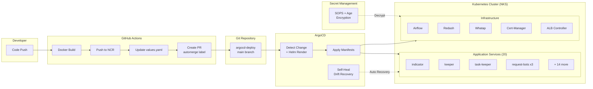

# GitOps 기반 Kubernetes 인프라 관리 플랫폼

> Helm + ArgoCD + SOPS 기반 멀티 환경 인프라스트럭처 관리
> 프로젝트: `argocd-deploy` (서비스 배포), `helm-deploy` (인프라 구성)

---

## 프로젝트 개요

20개 이상의 마이크로서비스와 핵심 인프라 컴포넌트를 **GitOps 방식**으로 관리하는 Kubernetes 배포 플랫폼.
Git 리포지토리가 Single Source of Truth로 동작하며, ArgoCD가 자동으로 클러스터 상태를 동기화합니다.

| 프로젝트 | 역할 |
|----------|------|
| **argocd-deploy** | 20개 서비스의 Helm 차트 + ArgoCD Application 정의 |
| **helm-deploy** | Airflow, ArgoCD, Redash, Whatap 등 인프라 Helm 값 관리 |

---

## 기술 스택

| 영역 | 기술 |
|------|------|
| **Orchestration** | Kubernetes (NCloud NKS) |
| **Package Manager** | Helm v3 |
| **GitOps** | ArgoCD (자동 Sync + Self-Healing) |
| **Secret Management** | SOPS + Age 암호화 |
| **Cloud** | Naver Cloud Platform (NKS, NCR, VPC DB) |
| **CI/CD** | GitHub Actions (Auto-merge workflow) |
| **Monitoring** | Whatap APM |
| **SSL/TLS** | Cert-Manager + Let's Encrypt |
| **Load Balancer** | NCloud ALB Ingress Controller |
| **Dashboard** | Redash (SQL 시각화) |

---

## 아키텍처

### 배포 흐름 (GitOps Pipeline)

```
Developer: Code Push
    ↓
GitHub Actions: Docker Build + Push (NCloud NCR)
    ↓
GitHub Actions: Clone argocd-deploy repo
    ↓
GitHub Actions: Update values-{env}.yaml (새 이미지 태그)
    ↓
GitHub Actions: Create PR (automerge 라벨)
    ↓
Auto-merge → main 브랜치 업데이트
    ↓
ArgoCD: Git 변경 감지 → Helm 렌더링
    ↓
ArgoCD: K8s 매니페스트 적용
    ↓
Rolling Update + Health Check
    ↓
Self-Healing (드리프트 자동 복구)
```

### 서비스 토폴로지

```
┌─────────────────────────────────────────────────┐
│              Kubernetes Cluster (NKS)            │
│                                                   │
│  ┌─── Ingress (ALB) ───┐                        │
│  │ Public  │  Private   │                        │
│  └─────────┴────────────┘                        │
│       │                                          │
│  ┌────┴──────────────────────────────────┐       │
│  │         Application Services          │       │
│  │                                       │       │
│  │  indicator    keeper    task-keeper    │       │
│  │  data-api     batch     whoami        │       │
│  │  keeper-console         proposal-admin │       │
│  │  scrumble               kafka-connect │       │
│  │  request-bot  partner-request-bot     │       │
│  │  eleven-request-bot                   │       │
│  └───────────────────────────────────────┘       │
│                                                   │
│  ┌────────────────────────────────────────┐      │
│  │         Infrastructure Services        │      │
│  │                                        │      │
│  │  ArgoCD    Airflow    Redash           │      │
│  │  Whatap    Cert-Manager  ALB Controller│      │
│  └────────────────────────────────────────┘      │
└──────────────────────────────────────────────────┘
```



---

## 핵심 기능 및 해결한 문제

### 1. 선언적 멀티 환경 배포

**문제:** 수동 배포로 인한 환경별 설정 불일치
**해결:**
```
services/{service-name}/
├── Chart.yaml              # Helm 차트 정의
├── values-live.yaml        # 운영 환경 설정
├── values-test.yaml        # 테스트 환경 설정
└── templates/
    ├── deployment.yaml     # K8s Deployment
    ├── service.yaml        # K8s Service
    ├── hpa.yaml            # Auto-Scaling
    └── namespace.yaml      # Namespace 격리
```
- 환경별 values 파일로 리소스, 레플리카, 이미지 분리
- 동일 차트 템플릿으로 환경 일관성 보장

### 2. Auto-Scaling (HPA)

**문제:** 트래픽 변동에 따른 수동 스케일링
**해결:**
- CPU 60% / Memory 80% 임계값 기반 자동 스케일링
- 서비스별 Min/Max 레플리카 설정 (3~12)
- Stateless 서비스(indicator, whoami, proposal-admin 등) 대상

### 3. Self-Healing + 무중단 배포

**문제:** 배포 중 서비스 중단, 설정 드리프트
**해결:**
```yaml
syncPolicy:
  automated:
    prune: true       # 불필요 리소스 자동 삭제
    selfHeal: true     # 드리프트 자동 복구

strategy:
  rollingUpdate:
    maxSurge: 1
    maxUnavailable: 0  # 무중단 보장
```
- Startup/Liveness/Readiness Probe 3단계 헬스체크
- Graceful Termination (preStop hook + 60초 grace period)

### 4. SOPS 기반 시크릿 암호화

**문제:** 인프라 설정 파일의 시크릿(DB 비밀번호, API 키) Git 저장 불가
**해결:**
```bash
# 암호화: 작업 디렉토리 → sops-encrypt/
./encrypt.sh

# 복호화: sops-encrypt/ → 작업 디렉토리
./decrypt.sh

# Age 암호화 키로 안전한 복호화
# 공개키만 레포에 저장, 비밀키는 로컬/CI 전용
```
- Kubeconfig, DB 자격증명, API 키 등 암호화 저장
- Git에서 변경 이력 추적 가능 (암호화 상태)
- CI/CD에서 SOPS_AGE_KEY로 자동 복호화

### 5. DB 백업 CronJob

**문제:** 운영 DB → 스테이징 DB 수동 동기화
**해결:**
- `db-backup-cronjob` Helm 차트로 정기 mysqldump
- Live → Staging 자동 데이터 마이그레이션
- Kubernetes CronJob으로 스케줄 관리

---

## 관리 규모

| 항목 | 수량 |
|------|------|
| **Application Services** | 20개 |
| **ArgoCD Applications** | 45+ (live + test + staging) |
| **Helm Charts** | 20개 (서비스) + 6개 (인프라) |
| **Environments** | 3개 (live, test, staging) |
| **Git Commits** | 2,300+ (자동 이미지 업데이트 PR 포함) |

---

## Helm 차트 구조 (반복 패턴)

모든 서비스가 동일한 차트 구조를 따르는 표준화된 설계:

```yaml
# deployment.yaml 공통 패턴
spec:
  replicas: {{ .Values.replicaCount }}
  strategy:
    rollingUpdate:
      maxSurge: 1
      maxUnavailable: 0
  template:
    spec:
      containers:
        - image: "{{ .Values.image.repository }}:{{ .Values.image.tag }}"
          resources:
            limits:
              cpu: {{ .Values.resources.limits.cpu }}
              memory: {{ .Values.resources.limits.memory }}
          livenessProbe:
            httpGet:
              path: {{ .Values.healthCheck }}
          readinessProbe:
            httpGet:
              path: {{ .Values.healthCheck }}
```

이미지 태그 포맷: `YYYYMMDD_HHMMSS-{git-sha-7자리}`

---

## 성과 및 효과

### 배포 속도 & 안정성
- **배포 자동화:** 코드 푸시에서 프로덕션 배포까지 **평균 5~10분** (기존 수동 배포: 30분~1시간)
- **무중단 배포:** Rolling Update + Health Check로 배포 중 서비스 중단 **0건**
- **Self-Healing:** 설정 드리프트 발생 시 자동 복구 → 수동 개입 필요 없음

### 운영 효율
- **20개 서비스 일원 관리:** 동일 Helm 차트 구조로 신규 서비스 추가 시 **30분 이내 배포 환경 구축 가능**
- **환경 일관성 보장:** values-live/test 분리로 환경별 설정 실수 **사전 방지**
- **시크릿 안전 관리:** SOPS 암호화로 Git에서 시크릿 변경 이력 추적 가능 + 유출 위험 최소화

### 비용 최적화
- **HPA 자동 스케일링:** 트래픽 기반 Pod 수 조절로 **유휴 리소스 30~40% 절감 추정**
- **DB 자동 백업:** CronJob 기반 Live→Staging 동기화로 수동 작업 제거
